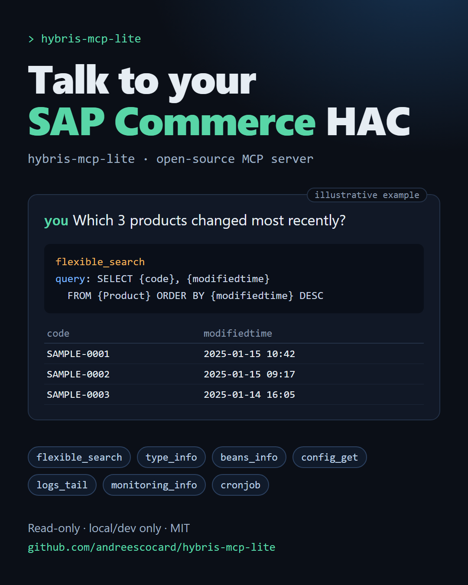

# hybris-mcp-lite



A read-only MCP server that lets Claude (or any MCP client) look inside a local SAP Commerce (Hybris) instance through HAC, in plain language.

> **Local/dev only. Not for production.**

## Why

HAC is useful, but it is a lot of tabs and forms when you just want a quick answer. This server exposes a small set of read-only HAC features as MCP tools, so you can ask about types, beans, config, cronjobs, logs and FlexibleSearch from your editor or chat client and stay where you are.

## Example prompts

- "What attributes does Product have, and which of them are localized?"
- "Which cronjobs failed recently?"
- "Show me the value of `catalog.sync.workers`."
- "Find the 10 most recently modified products in the Staged catalog."
- "Tail the last 200 log lines and show me only the errors."

## Tools

| Tool | What it does |
| --- | --- |
| `flexible_search` | Run a FlexibleSearch query, or translate it to SQL with `translate=true`. Capped at 200 rows. |
| `type_info` | Attributes, deployment table and subtypes of a type from the type system. |
| `beans_info` | Implementation class and aliases of a Spring bean. |
| `config_get` | Read one property or all properties. Values of keys matching `pass/secret/token/key/credential` are masked as `****`. |
| `logs_tail` | Tail the local console log (1 to 2000 lines), with an optional regex filter. |
| `monitoring_info` | Memory, threads, thread dump, cache or cluster diagnostics. |
| `cronjob` | `list` cronjobs or get the `status` of one by code. No trigger or abort. |

## Quick start

```bash
git clone https://github.com/andreescocard/hybris-mcp-lite.git
cd hybris-mcp-lite
npm install
npm run build
```

Then register the server with your client. You need a running local HAC and a HAC user.

### Claude Code

```bash
claude mcp add hybris-hac-lite \
  -e HAC_URL=https://localhost:9002/hac -e HAC_USER=admin -e HAC_PASS=... \
  -e HAC_INSECURE_TLS=true -e HAC_LOG_PATH=/path/to/console.log \
  -- node /absolute/path/to/hybris-mcp-lite/dist/index.js
```

### Claude Desktop

```json
{
  "mcpServers": {
    "hybris-hac-lite": {
      "command": "node",
      "args": ["/absolute/path/to/hybris-mcp-lite/dist/index.js"],
      "env": {
        "HAC_URL": "https://localhost:9002/hac",
        "HAC_USER": "admin",
        "HAC_PASS": "your-local-password",
        "HAC_INSECURE_TLS": "true",
        "HAC_LOG_PATH": "/path/to/console.log"
      }
    }
  }
}
```

## Configuration

| Variable | Required | Description |
| --- | --- | --- |
| `HAC_URL` | no | HAC base URL. Default `https://localhost:9002/hac`. |
| `HAC_USER` | yes | HAC user. |
| `HAC_PASS` | yes | HAC password. |
| `HAC_LOG_PATH` | for `logs_tail` | Path to the local console log file. |
| `HAC_TIMEOUT_MS` | no | Request timeout in ms. Default 30000. |
| `HAC_INSECURE_TLS` | no | Set to `true` to accept self-signed certificates (typical for local HAC). Off by default. |
| `HAC_ALLOW_REMOTE` | no | Set to `true` to allow a `HAC_URL` that is not a private host. See below. |

## Safety by design

- **Read-only tool set.** There is no Groovy console, ImpEx, SQL, system update, cache clear or reindex tool.
- **`commit=false`.** The tools that go through HAC's scripting console always submit with `commit=false`, so HAC rolls back any write.
- **Config masking.** `config_get` masks values of keys that look like secrets (`pass`, `secret`, `token`, `key`, `credential`).
- **Private-host guard.** The server refuses a `HAC_URL` unless the host is localhost, 127.x, ::1, 10.x, 172.16-31.x, 192.168.x, `*.local` or `*.localhost`. `HAC_ALLOW_REMOTE=true` overrides this.
- **Opt-in insecure TLS.** Certificate checks are only disabled when you set `HAC_INSECURE_TLS=true`.

One caveat: masking applies to `config_get` only. Output from `logs_tail` and `monitoring_info` (including thread dumps) is not masked and may contain sensitive data. Anything a tool returns is sent to your MCP client and its model.

## Development

```bash
npm test        # unit tests
npm run smoke   # runs every tool against the HAC in your env vars
```

## Disclaimer

Intended for local and development instances only, not for production. Provided as is, with no warranty.

SAP Commerce and Hybris are trademarks of SAP SE. This project is not affiliated with or endorsed by SAP.

## License

MIT

## Author

André Escocard, [LinkedIn](https://www.linkedin.com/in/andreescocard).
